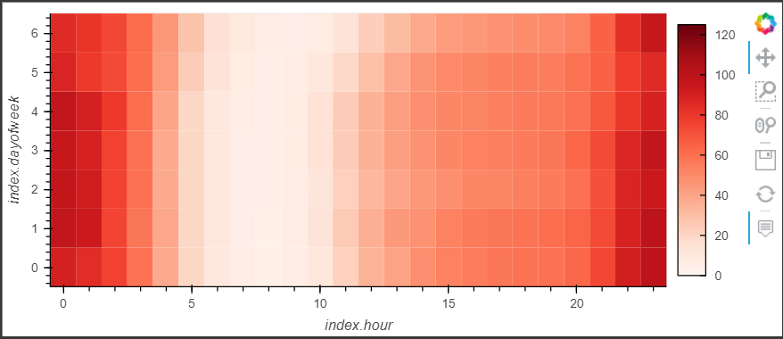
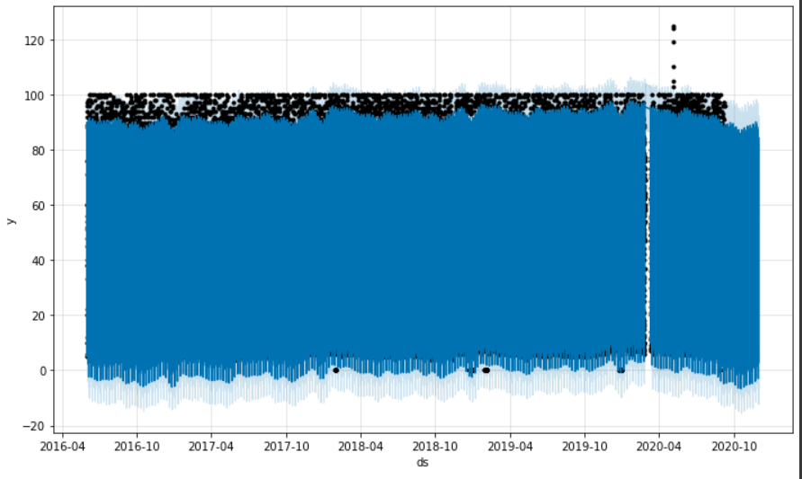

# CFB_Mod11_Challenge
# Mercado Libre Trends

This is a Python-based machine learning tool that looks at Mercado Libre search trends and relationship to stock prices.  The notebook was built using Google Colab.  Time series analysis is conducted on the search trend and stock price data to identify potential relationships.  There are visual depictions of seasonality.  Then FBProphet is used to create a time series model forecast of search traffic.  This also allows the user to see trends of the various components in weekly, daily and hourly timeframes.  

---

## Technologies

The application is written in Python in a Jupyter notebook in the cloud through Google Colab.  The following packages were utilized:    

*[Pandas] (https://github.com/pandas) - Data Analysis

*[FBProphet] (https://github.com/fbprophet) - Time Series Predictions

*[HoloViews] (https://github.com/holoviews) - Visualizations

*[hvPlot] (https://github.com/hvplot) - Interactive Plotting tools

## Installation Guide

Using Colab, the following lines are needed to install packages:

Install Pystan through the command **!pip install pystan**

Install FB Prophet through command **!pip install fbprophet**

Install HVPlot through command **!pip install hvplot**

Install Holoviews through command **!pip install holoviews**

## Usage and Content

To see the analysis, pls open the file **forecasting_net_prophet**. 

Here are some images from the tool:

## Contributors
Vishnu Kurella, vishnu.kurella@gmail.com

## License
VK.LQA 2021
